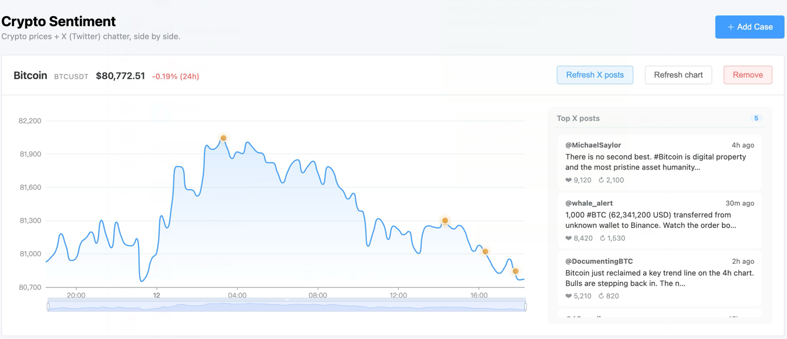

# Crypto Sentiment

A FastAPI + Vue 3 application for visualizing top cryptocurrency prices alongside the hottest X (Twitter) posts.

Stage 1 (current):

- Add a "case" by picking from the top 10 cryptocurrencies
- Each case becomes a panel showing a 24h, 15-minute resolution price line chart (Binance data)
- A "Fetch X posts" button pulls the top 5 hottest posts for that crypto (live from twitterapi.io when `TWITTERAPI_IO_KEY` is set; mock fixtures otherwise)
- Post timestamps appear as markers overlaid on the price chart, with stacked offsets when timestamps collide
- Posts and chart markers are bidirectionally highlighted on click
- X posts are returned to the UI only; they are not saved to Postgres yet

## Screenshot

Two cases (BTC and SOL) tracking 24h price action with their top X posts pulled in. Orange dots on the chart mark the post timestamps; clicking a post highlights its dot, and vice versa.



## Stack

- Backend: Python 3.11, FastAPI, SQLAlchemy 2 (async), asyncpg, Alembic, httpx
- Frontend: Vue 3 + Vite + TypeScript, Element Plus, ECharts (vue-echarts), Pinia, Axios
- DB: PostgreSQL 16 (via docker compose)

## Quick start

```bash
# 1. Start Postgres
docker compose up -d postgres

# 2. Backend
cd backend
python -m venv .venv && source .venv/bin/activate
pip install -r requirements.txt
cp .env.example .env
alembic upgrade head
uvicorn app.main:app --reload --port 8000

# 3. Frontend (new terminal)
cd frontend
pnpm install   # or npm install / yarn install
pnpm dev
```

- API docs: http://localhost:8000/docs
- Web app: http://localhost:5173

## From data sources to the web app

| What you see | Source | What you need |
| --- | --- | --- |
| 24h price chart | [Binance](https://www.binance.com) public REST API | Nothing extra for local dev (`BINANCE_API_BASE` defaults to `https://api.binance.com`) |
| X posts on demand | [twitterapi.io](https://twitterapi.io) | Sign up, copy your API key into `backend/.env` as `TWITTERAPI_IO_KEY` |
| Saved cases | PostgreSQL | `docker compose up -d postgres` and `alembic upgrade head` |

**Path to the UI:** start Postgres, the backend on port 8000, and the frontend dev server on port 5173, then open http://localhost:5173. Add a case to load klines from Binance. Click **Fetch X posts**; the frontend calls `/api/cryptos/{symbol}/posts`, the backend calls twitterapi.io, and the response is shown in the list and on the chart. The Vite dev server proxies `/api` to `http://localhost:8000`.

If `TWITTERAPI_IO_KEY` is empty, the same button still works but the backend serves mock post fixtures instead of calling twitterapi.io.

## Project layout

```
backend/   FastAPI service (routes, services, models, alembic)
frontend/  Vue 3 SPA (Element Plus + ECharts)
docker-compose.yml  Postgres for local dev
```

## Roadmap

- Persist fetched X posts in Postgres
- Add authentication and per-user `user_id`
- Stream realtime klines via Binance WebSocket
- Run sentiment analysis on posts and color-code scatter markers by sentiment
